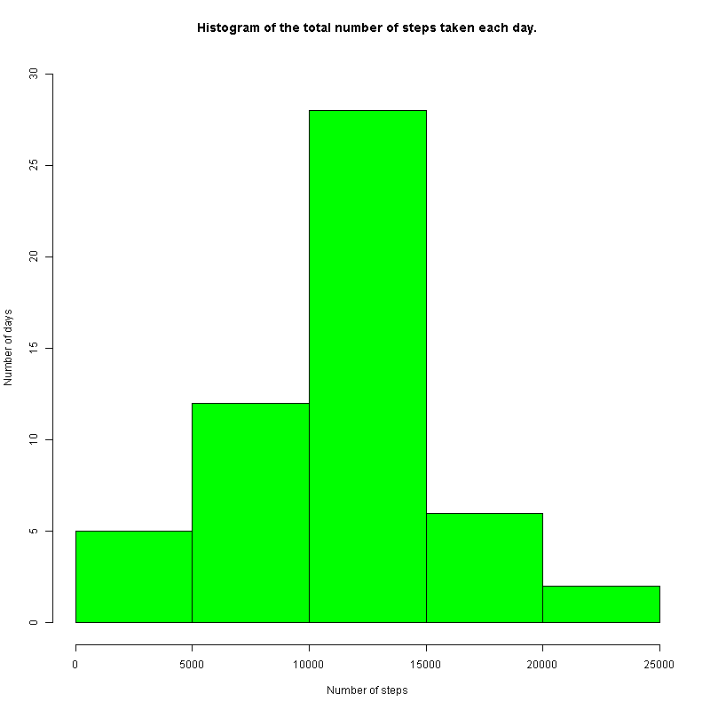
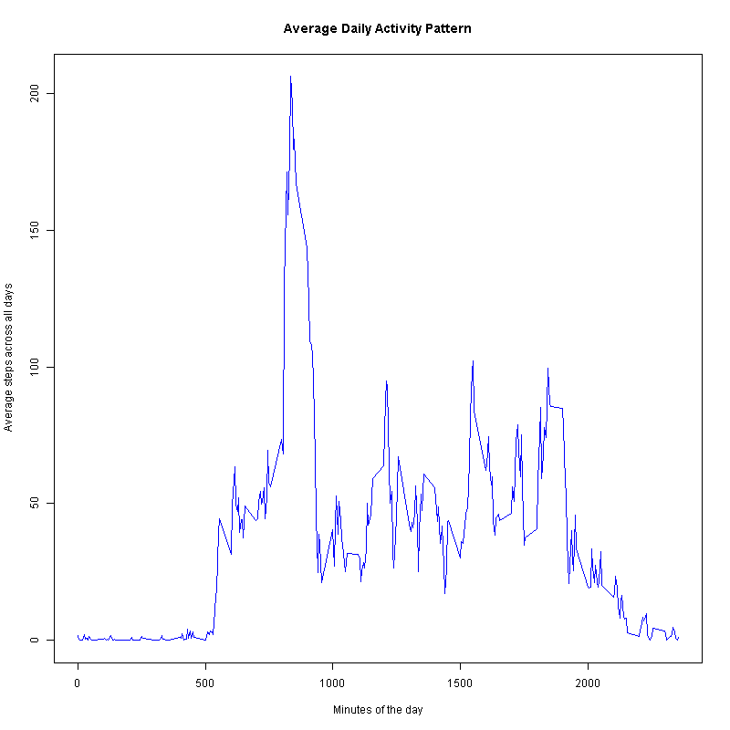
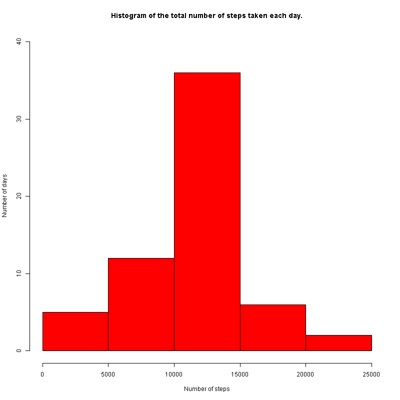
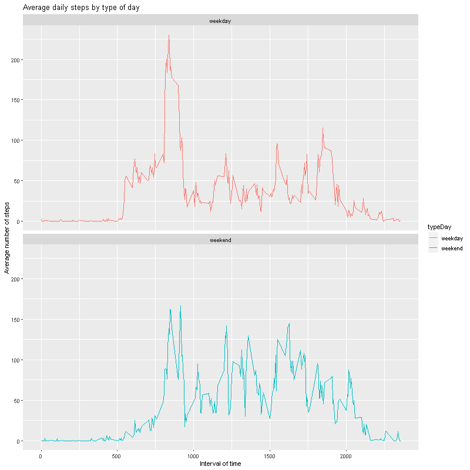

# Reproducible Research

# Load the data


```r
unzip("repdata_data_activity.zip")
data0 <- read.csv("activity.csv")
```

# 1) What is mean total number of steps taken per day?

## First: Total number of steps taken per day

```r
totalstepsperday <- aggregate(steps~date, data0, sum, na.rm = TRUE)
```

## Second: Histogram


```r
with(totalstepsperday, hist(x = steps, col = "green", ylim = c(0,30), main = "Histogram of the total number of steps taken each day.", xlab = "Number of steps", ylab = "Number of days"))
```



## Third: a) Mean of the total number of steps taken per day.


```r
totalStepsMean <- mean(totalstepsperday$steps)
totalStepsMean
```

```
## [1] 10766.19
```

## b) Median of the total number of steps taken per day.


```r
totalStepsMedian <- median(totalstepsperday$steps)
totalStepsMedian
```

```
## [1] 10765
```

# 2) What is the average daily activity pattern?

## First: Time series plot.

```r
library("dplyr")
StepsPerInterval <- summarise(group_by(na.omit(data0),interval), StepsAverage = mean(steps))
```

```
## `summarise()` ungrouping output (override with `.groups` argument)
```

```r
with(StepsPerInterval, plot(interval,StepsAverage, type = "l", col = "blue", main = "Average Daily Activity Pattern", xlab = "Minutes of the day", ylab = "Average steps across all days"))
```



## Second:5-minute interval, on average across all the days in the dataset, contains the maximun number of steps?


```r
intervalWithMaxSteps <- StepsPerInterval[which.max(StepsPerInterval$StepsAverage), ]
intervalWithMaxSteps
```

```
## # A tibble: 1 x 2
##   interval StepsAverage
##      <int>        <dbl>
## 1      835         206.
```
*We see that the interval with maximum number of steps, in average, is the 835 with 206.1698 steps in average*


# 3) Imputing missing values.

## First: Total number of rows with NA´s


```r
totalNA <- sum(is.na(data0))
totalNA
```

```
## [1] 2304
```

## Second: Devise a strategy for filling in all of the missing values in the dataset.

### We will fill all the rows with NA´s with the median per 5-minutes interval.


```r
NAToAverageInterval <- function(No.interval){
        StepsPerInterval[StepsPerInterval$interval == No.interval, ]$StepsAverage
}
```

## Third: New dataset with missing data filled in.


```r
data0NoNA <- data0

for(i in 1:nrow(data0NoNA)){
        if(is.na(data0NoNA[i,]$steps)){
                data0NoNA[i,]$steps <- NAToAverageInterval(data0NoNA[i,]$interval)
        }
}
```

## Fourth: Histogram of the total number of steps taken each day and calculate the mean and median total number of steps taken per day.


```r
totalStepsPerDayNoNA <- aggregate(steps ~ date, data = data0NoNA, sum)
with(totalStepsPerDayNoNA, hist(x = steps, col = "red", ylim = c(0,40), main = "Histogram of the total number of steps taken each day.", xlab = "Number of steps", ylab = "Number of days"))
```



## Mean of the total number of steps taken per day with no NA´s.


```r
totalStepsMeannoNa <- mean(totalStepsPerDayNoNA$steps)
totalStepsMeannoNa
```

```
## [1] 10766.19
```

## b) Median of the total number of steps taken per day with no NA´s.


```r
totalStepsMediannoNa <- median(totalStepsPerDayNoNA$steps)
totalStepsMediannoNa
```

```
## [1] 10766.19
```

*The mean did not change, but the median change in 1.19 steps*

# 4) Are there differences in activity patterns between weekdays and weekends?

## First: Create a new factor variable in the datasets with "weekday" and "weekend" as levels.


```r
# Convert variable date to type Date.
data0NoNA$date <- as.Date(strptime(data0NoNA$date, format = "%Y-%m-%d"))

adTypeDay <- function(dateDay){
        if(weekdays(dateDay) == "sábado" | weekdays(dateDay) == "domingo")
        {type <- "weekend"} else
        {type <- "weekday"}
}

# Apply to the dataset
data0NoNA$typeDay <- sapply(data0NoNA$date, adTypeDay)
```

## Second: Make a time series plot of the 5-minute interval and the average number of steps taken across all weekdays or weekends.


```r
dataAcrossWdWe <- aggregate(steps ~ interval + typeDay, data0NoNA, mean)
```


```r
library(ggplot2)
ggplot(data = dataAcrossWdWe, aes(x = interval, y = steps, color = typeDay))+
        geom_line() + 
        facet_wrap(~typeDay, ncol = 1, nrow = 2)+
        ggtitle("Average daily steps by type of day") +
        xlab("Interval of time") + 
        ylab("Average number of steps")
```




